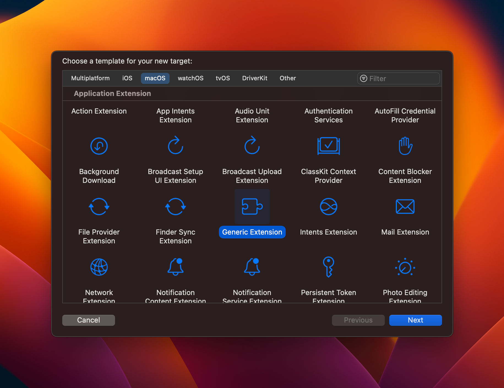
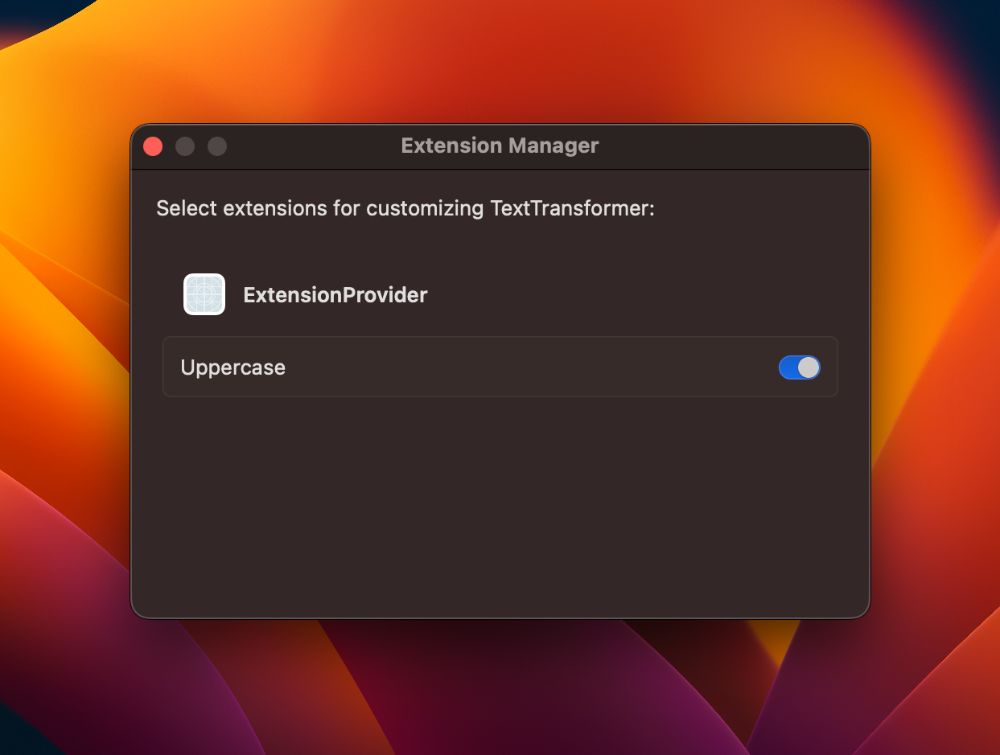

# TextTransformer: an ExtensionKit sample app

This year's WWDC introduced many new APIs, two of which caught my attention: ExtensionFoundation and ExtensionKit.

We've been able to develop extensions for Apple's apps and operating systems for a while, but Apple never offered a native way for third-party apps to provide custom extension points that other apps can take advantage of.

With ExtensionFoundation and ExtensionKit on macOS, now we can.

However, Apple's documentation lacks crucial information on how to use these new APIs (`FB10140097`), and there were no WWDC sessions or sample code available in the weeks following the keynote.

Thanks to some trial and error, and some help from other developers, I was able to put together this sample code, demonstrating how one can use ExtensionFoundation/ExtensionKit to define custom extension points for their Mac apps. 

## What the ExtensionFoundation and ExtensionKit frameworks provide

First of all, it's important to set clear expectations. ExtensionFoundation and ExtensionKit provide the underlying discovery, management, and declaration mechanism for your extensions. They do not provide the actual communication protocol that your app will be using to talk to its extensions.

What you get is a communication channel (via `NSXPCConnection`) that you can then use to send messages back and forth between your app and its extensions. If you're already used to XPC on macOS, then you're going to find it familiar. It's very similar to talking to a custom XPC service, agent, or daemon.

## Declaring a custom extension point

The main thing that's not explained in Apple's documentation at the time of writing is how apps are supposed to declare their own extension points to the system.

Extension points are identifiers (usually in reverse-DNS format) that apps providing extension points expose to apps that want to create extensions for those extension points.

In order to declare a custom ExtensionKit extension point for your Mac app, you have to include an `.appextensionpoint` file (or multiple files, one per extension point) in your app's bundle, under the `Extensions` folder.

This sample app has a `codes.rambo.experiment.TextTransformer.extension.appextensionpoint` file with the following contents:

```xml
<?xml version="1.0" encoding="UTF-8"?>
<!DOCTYPE plist PUBLIC "-//Apple//DTD PLIST 1.0//EN" "http://www.apple.com/DTDs/PropertyList-1.0.dtd">
<plist version="1.0">
<dict>
    <key>codes.rambo.experiment.TextTransformer.extension</key>
    <dict>
        <key>EXPresentsUserInterface</key>
        <false/>
    </dict>
</dict>
</plist>
```

It's a simple property list file listing the app's extension point identifier (`codes.rambo.experiment.TextTransformer.extension`) and, for this particular extension point, that extensions of this type do not present any user interface (`EXPresentsUserInterface` set to `false`).

The host app target is then configured with an additional `Copy Files` build phase in Xcode that copies the `.appextensionpoint` file into the `ExtensionKit Extensions` destination.

## Implementing an extension for a custom extension point

This sample code also includes an `ExtensionProvider` app, which demonstrates how apps can implement extensions for custom extension points.

The `ExtensionProvider` target itself doesn't do much, it only serves as a parent for the `Uppercase` target, which is an extension that implements the custom extension point above.

To create a target for a custom extension point, you can pick the "Generic Extension" template from Xcode's new target dialog.



The `Uppercase` target declares support for the custom extension point in its Info.plist by settings the corresponding identifier for the `EXAppExtensionAttributes.EXExtensionPointIdentifier` property:

```xml
<key>EXExtensionPointIdentifier</key>
<string>codes.rambo.experiment.TextTransformer.extension</string>
```

## Defining the API for extensions

Apps that wish to provide custom extension points that other developers can write extensions for are likely going to be providing some sort of library or SDK that clients can use.

This sample code emulates this in the form of `TextTransformerSDK`, a Swift package that defines a `TextTransformExtension` protocol, which looks like this:

```swift
/// Protocol implemented by text transform extensions.
///
/// You create a struct conforming to this protocol and implement the ``transform(_:)`` method
/// in order to perform the custom text transformation that your extension provides to the app.
public protocol TextTransformExtension: AppExtension {
    
    /// Transform the input string according to your extension's behavior
    /// - Parameter input: The text entered by the user in TextTransformer.
    /// - Returns: The output that should be shown to the user, or `nil` if the transformation failed.
    func transform(_ input: String) async -> String?
    
}
```

Apps that wish to provide extensions can then implement a type that conforms to the given extension protocol, like the `Uppercase` extension does:

```swift
import TextTransformerSDK

/// Sample extension that transforms the input into its uppercase representation.
@main
struct Uppercase: TextTransformExtension {
    typealias Configuration = TextTransformExtensionConfiguration<Uppercase>
    
    var configuration: Configuration { Configuration(self) }
    
    func transform(_ input: String) async -> String? {
        input.uppercased()
    }
    
    init() { }
}
```

## Enabling extensions

Even with all of the above correctly set up, if you try to use [the API to find extensions](https://developer.apple.com/documentation/extensionfoundation/appextensionidentity/4043633-matching) for your custom extension point, you're likely going to get zero results.

That's because every new extension for your extension point is disabled by default, and the system requires user interaction in order to enable the use of a newly discovered extension within your app.

In order to present the user with a UI that will let them enable/disable extensions for your app's custom extension point, you can use [EXAppExtensionBrowserViewController](https://developer.apple.com/documentation/extensionkit/exappextensionbrowserviewcontroller), which this sample app presents on first launch if it detects that no extensions are enabled, or when the user clicks the "Manage Extensions" button.



After extensions are enabled, they will then be returned in the async sequence you can subscribe to with [AppExtensionIdentity.matching](https://developer.apple.com/documentation/extensionfoundation/appextensionidentity/4043633-matching).

## Communication between the app and its extensions

This is a bonus section, since the communication between an app and its extensions is implemented through XPC, which is outside the scope of this sample app.

The way I chose to implement the simple protocol used by TextTransformer was to define a `TextTransformerXPCProtocol` that gets exposed over the `NSXPCConnection`.

Here's the protocol itself:

```swift
@_spi(TextTransformerXPC)
@objc public protocol TextTransformerXPCProtocol: NSObjectProtocol {
    func transform(input: String, reply: @escaping (String?) -> Void)
}
```

Note that even though the protocol is declared as `public`, I don't want clients of my fictional SDK to have to worry about its existence, since the entire XPC communication is abstracted away. However, I need to be able to expose this protocol to the TextTransformer app itself, hence the use of `@_spi`, which has a scary underscore in front of it, but is the perfect solution for this need (exposing a piece of API only to a specific client that "knows" about it).

I then implemented a `TextTransformerExtensionXPCServer` class that is used as the `exportedObject` for the `NSXPCConnection` from the extension side:

```swift
@objc final class TextTransformerExtensionXPCServer: NSObject, TextTransformerXPCProtocol {
    
    let implementation: any TextTransformExtension
    
    init(with implementation: some TextTransformExtension) {
        self.implementation = implementation
    }
    
    func transform(input: String, reply: @escaping (String?) -> Void) {
        Task {
            let result = await implementation.transform(input)
            await MainActor.run { reply(result) }
        }
    }
    
}
```

The glue is implemented in `TextTransformExtensionConfiguration`, which is the configuration type associated with the `TextTransformExtension` protocol.

From the point of view of an extension implementing the `TextTransformExtension` protocol, all they have to do is return an instance of `TextTransformExtensionConfiguration` for the `configuration` property, as seen in the `Uppercase` implementation above.

```swift
extension TextTransformExtensionConfiguration {
    /// You don't call this method, it is implemented by TextTransformerSDK and used internally by ExtensionKit.
    public func accept(connection: NSXPCConnection) -> Bool {
        connection.exportedInterface = NSXPCInterface(with: TextTransformerXPCProtocol.self)
        connection.exportedObject = server
        
        connection.resume()
        
        return true
    }
}
```

The counterpart for this is `TextTransformerExtensionXPCClient`, which is implemented in the TextTransformer app target itself, since it's not something that extension implementers have to use.

When a request is made to perform a transformation to the text, `TextTransformExtensionHost` creates a new [AppExtensionProcess](https://developer.apple.com/documentation/extensionfoundation/appextensionprocess) from the extension that the user has selected in the UI.

From that process, it then instantiates a `TextTransformerExtensionXPCClient`, which grabs a new `NSXPCConnection` handle from the `AppExtensionProcess` and configures it to use the `TextTransformerXPCProtocol`:

```swift
// TextTransformerExtensionXPCClient.swift

public func runOperation(with input: String) async throws -> String {
    // ...
    
    let connection = try process.makeXPCConnection()
    connection.remoteObjectInterface = NSXPCInterface(with: TextTransformerXPCProtocol.self)
    
    connection.resume()
    
    // ...
}
```

The rest is pretty much just grabbing the remote object proxy (an instance of _something_ that implements `TextTransformerXPCProtocol`) and calling the `transform` method, which will cause the method to be called on the instance of `TextTransformerExtensionXPCServer` that's running in the app extension, which in turn calls the `transform` method defined by the `TextTransformExtension` protocol.

If you're not familiar with XPC, this may all seem really alien, but it's not as complicated as it sounds.

## Comments and use cases

Plug-ins for software have been around for a really long time. Traditional ways of implementing plug-ins on macOS would typically involve the host app loading an untrusted bundle of code into its own address space, which can have serious impacts in performance, security, and reliability.

When Apple began introducing extensions into its operating systems back in the iOS 8 days, the approach was quite different. Extensions are completely separate processes that run within their own sandbox and can't mess with the memory of the process that they're loaded into.

The result is a system that protects user privacy and leads to a more reliable experience overall, since in general a poorly behaving extension can't crash the app that's trying to use it (but that largely depends on how the extension hosting is implemented).

Use cases for custom extension points on Mac apps include any idea that involves external developers augmenting our apps with code running at native speeds, with access to the full macOS SDK, while at the same time isolating that code from our apps, protecting the trust that users have in them. 

ExtensionKit extension points can even provide UI, which I haven't covered here, and that expands the realm of possibilities even more.

If you have a Mac app that currently provides other ways for developers to write scripts or extensions for it, or if you have an idea for a type of app that could benefit from third-party extensions, I'd consider implementing them with ExtensionKit. 
